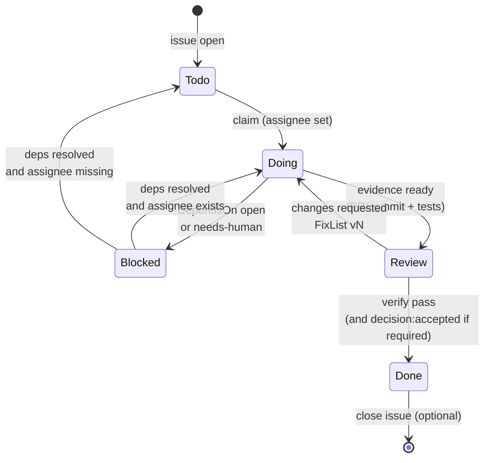

# Label 目录与监听矩阵（V1 固定）

## 目的

固定 label 命名，避免不同项目/角色各起一套名字导致路由失效。

标签规范与 `workflow.toml` 的 `[labels]` 段保持一致；若不一致，以项目 `workflow.toml` 为准并同步更新本目录。

## 固定命名空间

- 路由：`to:*`
- 状态：`state:*`
- 决策：`decision:*`
- 审查判定：`review:*`（Phase 2.8 起可选；本仓库已启用）
- 质量判定：`qa:*`（Phase 2.8 起可选；本仓库已启用）
- 控制：`needs-human`, `autoflow:off`
- 类型：`kind:*`
- 优先级：`prio:*`
- 契约：`contract:*`（可选扩展）

## 必选标签集合（V1）

### 路由标签

- `to:architect`
- `to:backend`
- `to:frontend`
- `to:qa`
- `to:integrator`
- `to:recorder`

### 状态标签

- `state:todo`
- `state:doing`
- `state:blocked`
- `state:review`
- `state:done`

### 决策标签

- `decision:proposed`
- `decision:accepted`
- `decision:rejected`

### 审查判定标签（Phase 2.8）

- `review:approved`
- `review:changes_requested`

### QA 判定标签（Phase 2.8）

- `qa:pass`
- `qa:fail`

### 控制标签

- `needs-human`: 必须人类介入，停止自动化推进
- `autoflow:off`: 关闭自动路由/自动状态迁移，仅人工推进

### 类型标签

- `kind:task`
- `kind:bug`
- `kind:question`
- `kind:proposal`
- `kind:blocker`

### 优先级标签

- `prio:p0`
- `prio:p1`
- `prio:p2`
- `prio:p3`

## 可选扩展（建议但不强制）

- `contract:breaking`：接口破坏性变更风险（通常由 architect/integrator 使用）

## 标签多重性（Multiplicity）

说明：底层承载系统（GitHub/GitLab/SQLite）通常允许一个 Issue 拥有多个 labels，但在本协议中不同命名空间的 labels 有不同“多选/互斥”语义。

允许多选（可以同时存在多个）：

- 路由标签：`to:*`
  - 例：`to:backend` + `to:qa`（并行关注/并行处理）
- 控制标签：`needs-human`、`autoflow:off`
  - 例：既需要人类介入，也关闭自动流转
- 契约扩展：`contract:*`
  - 允许同时存在多个风险标签（若项目扩展出更多 `contract:*`）

建议互斥（同一时刻最多一个；若出现多个，需由 lead/integrator normalize）：

- 状态标签：`state:*`（`state:todo/doing/blocked/review/done` 只能存在一个）
- 类型标签：`kind:*`（`kind:task/bug/...` 只能存在一个）
- 优先级标签：`prio:*`（`prio:p0/p1/p2/p3` 只能存在一个）
- 决策标签：`decision:*`（`decision:proposed/accepted/rejected` 只能存在一个）

备注：

- `review:*` 与 `qa:*` 均应视为互斥集合（同一时刻最多一个结论），并由单写者（推荐：`lead-integrator`）负责 normalize。

## 监听矩阵（默认）

说明：

- 本文中的 “listen A, B” 建议按 AND 语义理解：issue 同时具备这些 labels 才算命中该角色队列。
- assignee 与 @mention 仍然是额外路由信号：被指派/被点名的 issue/comment 应当被处理（见 `docs/workflow/issue-protocol.md`）。
- Phase 1 人工跑通时，`state:*` 是推荐标签（Soft）：缺失不应阻塞开工，但会影响队列过滤与后续自动化。

- `architect`: listen `to:architect`, `decision:proposed`
- `backend`: listen `to:backend`
- `frontend`: listen `to:frontend`
- `qa`: listen `to:qa`, `state:review`
- `integrator`: listen `to:integrator`, `state:review`
- `recorder`: listen `to:recorder`

所有角色都应额外监听：

- `needs-human`（仅上报，不自动推进）
- 被直接 `@mention` 的 issue/comment

## 状态迁移（最小规则）

状态机推荐视图（Mermaid，帮助快速理解 `state:*` 的互斥与迁移；Phase 1 下 `state:*` 缺失不应阻塞开工，但建议尽量补齐以保持队列清晰）：

- `todo -> doing`：claim 成功（assignee 已设置；`/claim` 仅可作为触发 assign 的指令，文本本身不算成功）
- `doing -> blocked`：存在未满足依赖，或被标记 `needs-human`
- `blocked -> doing|todo`：依赖满足（DependsOn resolved/closed）后解除阻塞：
  - assignee 仍存在：恢复到 `state:doing`
  - 无 assignee：恢复到 `state:todo`
  解除阻塞可自动（`auto_unblock_when_dependency_closed = true`）或由 integrator/lead 通过 `/unblock` 手动执行
- `doing -> review`：实现完成并提供证据
- `review -> doing`：审查/验收未通过（例如 `review:changes_requested`、QA fail、CI fail），进入修复迭代并由单写者（推荐：lead-integrator）汇总 `FixList vN` 再指派
- `review -> done`：验证通过，且（若该 issue 存在决策闸门，例如带 `decision:proposed`）必须满足 `decision:accepted`

## 冲突与仲裁

- 状态冲突时优先级：
  - `needs-human` > `state:blocked` > `state:review` > `state:doing` > `state:todo`
- 决策冲突时优先级：
  - `decision:rejected` 优先于 `decision:accepted`，直到 approver 重新 `/accept`
